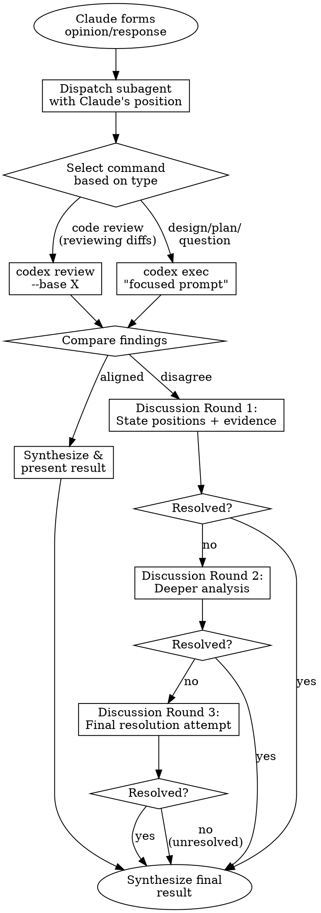

# Codex Peer Review

Peer validation system using OpenAI Codex CLI. Validates Claude's designs and code reviews through structured discussion before presenting to user.

**Core principle:** Two AI perspectives catch more issues than one. When they disagree, a 3-round structured discussion resolves most issues. If still unresolved, both positions are presented to the user to decide.

## Reference Files

@discussion-protocol.md
@common-mistakes.md

## Modes of Operation

### Mode 1: Auto-Trigger (Validation Only)

**Triggers before Claude presents:**
- Implementation plans or designs
- Code review results
- Architecture recommendations
- Major refactoring proposals

**Behavior:** Validates existing work, does not create from scratch.

### Mode 2: Slash Command (Full Lifecycle)

```
/codex-peer-review              # Review current changes
/codex-peer-review --base main  # Review against specific branch
/codex-peer-review [question]   # Validate answer to broad question
```

**Behavior:** Can both create and validate reviews/designs.

## Workflow



## Subagent Dispatch

**CRITICAL:** Always use subagent to avoid context pollution. Never run Codex in main context.

### Output Protection

**All `codex exec` invocations MUST include these safeguards to prevent OOM and uncontrolled execution:**

| Safeguard | Implementation | Purpose |
|-----------|---------------|---------|
| Tool prevention | End prompts with `IMPORTANT: Do not use any tools. Respond with text analysis only.` | Prevents Codex from running tools in full-auto mode |
| Timeout | Wrap with `timeout 120` | Prevents runaway execution |
| Output cap | Pipe through `head -c 500000` | Prevents OOM from large outputs (500KB limit) |
| Temp files | Use `mktemp /tmp/codex_*.XXXXXX` | Prevents collisions and path prediction |
| Cleanup | `rm -f "$TMPFILE"` after reading | Prevents temp file accumulation |

### Content Inclusion

**Embed file contents directly in prompts** instead of referencing file paths for Codex to read:

- Use `git diff`, `git show`, or `Read` to get content first
- Paste the relevant code/diff into the `codex exec` heredoc
- This prevents Codex from accessing arbitrary files in full-auto mode
- Keep included content focused — only the relevant sections, not entire files

### Command Selection (IMPORTANT)

| Validation Type | Command | Use When |
|-----------------|---------|----------|
| **Code Review** | `codex review --base X` | Reviewing actual code changes (diffs) |
| **Design/Plan Validation** | `codex exec "..."` | Validating proposals, designs, refactoring plans |
| **Question Answering** | `codex exec "..."` | Answering broad technical questions |
| **Architecture Review** | `codex exec "..."` | Validating architecture recommendations |

**DO NOT** use `codex review` to validate designs/plans - it reviews the entire diff, not your proposal.

### Validation Subagent

Dispatch via Task tool with prompt:

```
You are validating Claude's analysis using OpenAI Codex CLI.

## Claude's Position
[Claude's findings/design/recommendations]

## Scope
- Type: [code-review|design|architecture|question]
- Files: [relevant files - be specific!]

## Task - CHOOSE THE RIGHT COMMAND

### If Type is "code-review" (reviewing actual code changes):
Run: codex review --base [branch]

### If Type is "design", "architecture", or "question":
Run: codex exec with heredoc (avoids escaping issues and permission prompts):

```bash
REVIEW_FILE=$(mktemp /tmp/codex_review.XXXXXX.json)
timeout 120 codex exec <<'EOF' 2>&1 | head -c 500000 | tee "$REVIEW_FILE"
Validate this [design|refactoring plan|architecture proposal]:

[Summarize Claude's specific proposal in 2-3 sentences]

[Paste relevant code content here - do NOT reference file paths]

Check for:
- Architecture issues
- Potential problems with this approach
- Better alternatives
- Missing considerations

Provide specific, actionable feedback.

IMPORTANT: Do not use any tools. Respond with text analysis only.
EOF
```

## Compare and Classify
After running the appropriate command:
1. Compare Codex output to Claude's position
2. Classify: agreement | disagreement | complement

## Return Format
{
  "outcome": "agreement|disagreement|complement",
  "codex_findings": [...],
  "alignment": {
    "agreed": [...],
    "unique_to_claude": [...],
    "unique_to_codex": [...]
  },
  "discussion_needed": boolean,
  "discussion_topics": [...]
}
```

### Discussion Subagent

**IMPORTANT:** Use Codex session IDs to maintain conversation context across discussion rounds. This allows Codex to remember prior discussion context.

#### Round 1 (Initial Discussion)

```
Discussion Round 1

## Claude's Position
[Current stance with evidence]

## Prerequisites Check
First, verify tools are available:
- Check codex: `which codex || echo "ERROR: codex CLI not installed"`
- Check jq (optional but recommended): `which jq || echo "WARNING: jq not available, will use grep fallback"`

## Task
1. Run codex exec with --json and capture output to extract session ID:

   ```bash
   ROUND1_FILE=$(mktemp /tmp/codex_round1.XXXXXX.json)
   timeout 120 codex exec --json <<'EOF' 2>&1 | head -c 500000 | tee "$ROUND1_FILE"
   Given this disagreement about [topic]:

   Claude's position: [summary with evidence]

   Provide your evidence-based reasoning. Reference specific code or conventions.
   What is your position and why?

   IMPORTANT: Do not use any tools. Respond with text analysis only.
   EOF
   ```

2. Extract session ID for subsequent rounds:
   ```bash
   # Extract thread_id from JSON output (grep fallback if jq unavailable)
   if command -v jq &>/dev/null; then
     SESSION_ID=$(jq -r 'select(.type=="thread.started") | .thread_id' "$ROUND1_FILE" 2>/dev/null | head -1)
   else
     SESSION_ID=$(grep -o '"thread_id":"[^"]*"' "$ROUND1_FILE" 2>/dev/null | head -1 | cut -d'"' -f4)
   fi

   [ -z "$SESSION_ID" ] && echo "WARNING: Could not extract session ID. Subsequent rounds will start fresh."
   ```

4. Parse Codex response and attempt synthesis

## Return Format
{
  "session_id": "[thread_id or null if extraction failed]",
  "codex_response": "...",
  "resolution_possible": boolean,
  "proposed_synthesis": "...|null",
  "remaining_disagreement": "...|null",
  "continue_discussion": boolean
}
```

#### Round 2 (Continued Discussion)

```
Discussion Round 2

## Task
1. Resume the previous Codex session (if session ID available):

   ```bash
   # If we have a session ID, resume; otherwise start fresh with context
   ROUND2_FILE=$(mktemp /tmp/codex_round2.XXXXXX.json)
   if [ -n "$SESSION_ID" ]; then
     timeout 120 codex exec resume "$SESSION_ID" --json <<'EOF' 2>&1 | head -c 500000 | tee "$ROUND2_FILE"
   else
     timeout 120 codex exec --json <<'EOF' 2>&1 | head -c 500000 | tee "$ROUND2_FILE"
   fi
   Claude responds to your points:

   [Claude's Round 2 response with new evidence]

   Can we reach synthesis? What is your final position?

   IMPORTANT: Do not use any tools. Respond with text analysis only.
   EOF
   ```

2. Parse Codex response
3. Determine if resolved or needs Round 3

## Return Format
{
  "session_id": "[thread_id or null]",
  "session_resumed": boolean,  // false if fallback was used
  "codex_response": "...",
  "resolution_possible": boolean,
  "proposed_synthesis": "...|null",
  "remaining_disagreement": "...|null",
  "continue_to_round3": boolean
}
```

#### Round 3 (Final Resolution Attempt)

```
Discussion Round 3

## Task
1. Resume the previous Codex session (if session ID available):

   ```bash
   ROUND3_FILE=$(mktemp /tmp/codex_round3.XXXXXX.json)
   if [ -n "$SESSION_ID" ]; then
     timeout 120 codex exec resume "$SESSION_ID" --json <<'EOF' 2>&1 | head -c 500000 | tee "$ROUND3_FILE"
   else
     timeout 120 codex exec --json <<'EOF' 2>&1 | head -c 500000 | tee "$ROUND3_FILE"
   fi
   Final round. Claude's strongest argument:

   New evidence: [final evidence not yet presented]
   Key concession: [what Claude now accepts]
   Core position: [Claude's refined stance with strongest reasoning]

   This is the last round. Please provide your final position:
   1. Can we reach a synthesis?
   2. If not, state your final position clearly.

   IMPORTANT: Do not use any tools. Respond with text analysis only.
   EOF

   # Clean up all temp files
   rm -f "$ROUND1_FILE" "$ROUND2_FILE" "$ROUND3_FILE"
   ```

2. Parse Codex response
3. If resolved → synthesize. If not → present both positions to user.

## Return Format
{
  "session_id": "[thread_id or null]",
  "session_resumed": boolean,
  "codex_response": "...",
  "resolution_possible": boolean,
  "proposed_synthesis": "...|null",
  "remaining_disagreement": "...|null",
  "present_to_user": boolean
}
```

**Why session IDs matter:** Without resuming the session, Codex starts fresh and loses context from prior rounds. The fallback (re-providing context) works but is less efficient and may lose nuance.

## Codex CLI Commands

### For Code Review (reviewing actual diffs)

**IMPORTANT:** If the base branch is not explicitly provided, you MUST use the `AskUserQuestion` tool to ask the user which branch to compare against. Do NOT guess or auto-detect the base branch.

```yaml
# Use AskUserQuestion to determine base branch
question: "Which branch should I compare against for the code review?"
header: "Base branch"
options:
  - label: "main"
    description: "Compare against the main branch"
  - label: "develop"
    description: "Compare against the develop branch"
  - label: "master"
    description: "Compare against the master branch"
# User can also select "Other" to provide a custom branch name
```

**Passing Focus Context:** If Claude's review focused on specific areas (e.g., security, a particular module, error handling), pass this context to Codex so both reviews are aligned.

Once the base branch is confirmed:
```bash
# Basic review against a branch
codex review --base [user-confirmed-branch]

# With focus instructions (RECOMMENDED - keeps Codex aligned with Claude's review focus)
codex review --base [user-confirmed-branch] "Focus on [Claude's review area, e.g., security in the auth module]"

# Review uncommitted changes only
codex review --uncommitted "Focus on [area]"

# Review a specific commit
codex review --commit [SHA] "Focus on [area]"

# Read instructions from stdin (useful for longer prompts)
echo "Focus on security vulnerabilities and error handling in the authentication flow" | codex review --base main -
```

**Key:** Always pass Claude's review focus (e.g., "security in authentication flow", "error handling in API endpoints", "the UserService refactoring") to Codex so both AIs examine the same areas.

### For Design/Plan Validation (NOT code review!)

**Always use heredoc, timeout, output cap, and tool-prevention suffix:**
```bash
# Validate a refactoring proposal
timeout 120 codex exec <<'EOF' | head -c 500000
Validate this refactoring plan for the data processor module: Extract 3 classes
(Validator, Parser, Invoker) to fix SRP violation. Is this appropriate? What are the risks?

IMPORTANT: Do not use any tools. Respond with text analysis only.
EOF

# Validate architecture recommendation
timeout 120 codex exec <<'EOF' | head -c 500000
Review this architecture decision: Use event-driven pattern for notification system
instead of direct calls. Context: [language/framework] with dependency injection.
Check for issues.

IMPORTANT: Do not use any tools. Respond with text analysis only.
EOF

# Answer a broad technical question
timeout 120 codex exec <<'EOF' | head -c 500000
In a multi-module project, should shared DTOs go in the common module or a dedicated
api-contracts module? Consider: compile dependencies, versioning, encapsulation.

IMPORTANT: Do not use any tools. Respond with text analysis only.
EOF
```

**REMEMBER:** `codex review` reviews the entire git diff. `codex exec` validates a specific proposal.

## Output Formats

### Agreement
```markdown
## Peer Review Result
**Status:** Validated
**Confidence:** High (both AIs aligned)

[Synthesized recommendations with both perspectives merged]
```

### Resolved Disagreement
```markdown
## Peer Review Result
**Status:** Resolved through discussion

**Initial Positions:**
- Claude: [position]
- Codex: [position]

**Resolution:** [how resolved, which evidence won]

**Final Recommendation:** [synthesized view]
**Confidence:** Medium-High
```

### Unresolved Disagreement
```markdown
## Peer Review Result
**Status:** Unresolved — user decision needed
**Confidence:** Positions diverge after 3 rounds of discussion

**Claude's Position:** [summary with key evidence]

**Codex's Position:** [summary with key evidence]

**Where They Agree:** [common ground, if any]

**Where They Differ:** [core disagreement]

**Your Call:** [what the user needs to decide, framed as a clear choice]
```

## Prerequisites

**Before using this skill, verify the following:**

```bash
# 1. Check if Codex CLI is installed
if ! command -v codex &>/dev/null; then
  echo "ERROR: Codex CLI not installed."
  echo "Install with: npm i -g @openai/codex"
  echo "Or via Homebrew: brew install openai-codex"
  exit 1
fi

# 2. Check authentication status
codex login --check 2>/dev/null || {
  echo "WARNING: Codex may not be authenticated."
  echo "Run 'codex login' to authenticate."
}

# 3. Optional: Check for jq (improves session ID extraction)
command -v jq &>/dev/null || echo "TIP: Install jq for better JSON parsing: brew install jq"
```

**If Codex CLI is not available:**
- The skill will not work for code review or design validation
- Inform the user: "Codex CLI is required for peer review. Please install it with `npm i -g @openai/codex`"

## Quick Reference

| Scenario | Command | Action |
|----------|---------|--------|
| About to present design/plan | `codex exec` | Validate specific proposal |
| About to present code review | `codex review --base X` | Review the diff |
| About to present refactoring proposal | `codex exec` | Validate specific proposal |
| About to present architecture recommendation | `codex exec` | Validate specific proposal |
| User asks broad question | `codex exec` | Answer via focused prompt |
| Codex agrees | - | Synthesize and present |
| Codex disagrees | - | Start discussion protocol |
| Three rounds fail | - | Present both positions to user |

**Key distinction:**
- Use `codex review` ONLY when reviewing actual code changes (git diff)
- Use `codex exec` for everything else (designs, plans, questions, recommendations)
